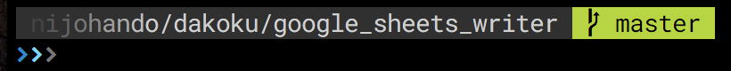
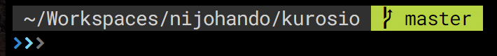
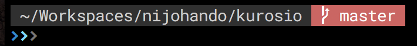
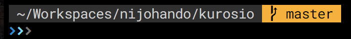
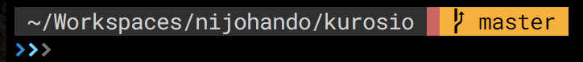
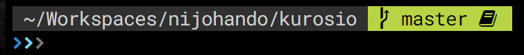
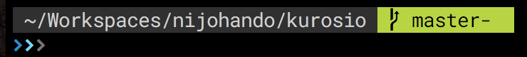
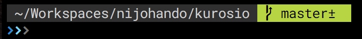
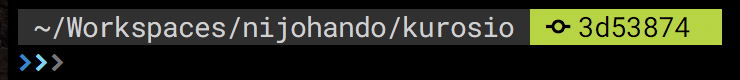

# Kurosio

Simple prompt for [fish shell](http://fishshell.com/).

## Installation

* With [fisherman](https://github.com/fisherman/fisherman)

```
fisher nijohando/kurosio
```
__Note:__ Default confiuration requires [Nerd Fonrs](https://github.com/ryanoasis/nerd-fonts)

## Feature

### Cliping long path depends on screen width

Kurosio focuses the tail of the long path overflowing from the screen width.



### Git awareness

* Clean



* Dirty / Touched



* Staged



* Staged and dirty / touched



* Stashed



* Unpushed commit


* Unpulled commit



* Unpushed and unpulled commit



* Detached HEAD




